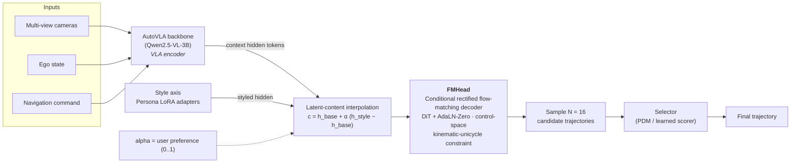

# Drive-Yourself (YouDrive)

**Personalized, style-controllable autonomous driving on a Vision–Language–Action backbone with a flow-matching planner.**

Drive-Yourself treats *driving style* as an explicit, user-steerable axis instead of an
afterthought entangled with scene understanding and a single-mode decoder. We build on the
[AutoVLA](https://github.com/ucla-mobility/AutoVLA) backbone (Qwen2.5-VL-3B), replace the
argmax codebook decoder with a **conditional rectified flow-matching trajectory head (FMHead)**,
and inject style through **latent-content interpolation** driven by persona LoRA adapters. Because
the planner *samples* multiple candidate trajectories and then *selects* one, multi-modal scenes
are resolved by a decisive sample-and-select step rather than being averaged into a hesitant,
between-mode trajectory.

---

## Why this project

End-to-end driving is trained on large trajectory corpora under objectives that favor a single
consensus behavior — effectively **one "average driver"** for every user and every scene. This
produces two measurable failures:

1. **Style is collapsed.** Planners with *similar* closed-loop safety scores can occupy *very
   different* regions of a multi-dimensional style profile (speed, acceleration, jerk, headway,
   spacing). Optimizing safety alone squashes diverse, user-relevant ways of driving into one
   interchangeable "good enough" bucket.
2. **Multi-modal compromise.** When several maneuvers are equally plausible, averaged learning and
   single-path decoding produce between-mode trajectories instead of a clear commitment.

Driving style should be **measurable, interpretable, and controllable**, varying with user
preference while still respecting the scene. That is what this repo explores.

---

## Method (VLA + Flow-Matching planner)



**Pipeline stages**

| Stage | What it does |
|---|---|
| **AutoVLA backbone** | Qwen2.5-VL-3B encodes multi-view images + ego state + navigation command into context hidden tokens. |
| **Style axis** | Persona LoRA adapters produce a *styled* hidden state; latent-content interpolation `c = h_base + α·(h_style − h_base)` exposes a single continuous knob `α` for how strongly to apply a persona (α = 0 → base, α = 1 → full persona). |
| **FMHead** | A conditional rectified flow-matching decoder (DiT + AdaLN-Zero) conditioned on `c`. The **fm3-kin** variant decodes in control space `(a_long, yaw_rate)` under a kinematic-unicycle constraint, so every sample is dynamically feasible. |
| **Sample** | The flow ODE is integrated N = 16 times to yield N multi-modal candidate trajectories. |
| **Select** | One candidate is chosen. Selection is the active research axis (see below). |

The **initial fm3-kin FMHead is our validated-best generator** and the reference configuration for
all downstream experiments.

---

## Key results (navtest v1 PDMS)

Full per-configuration numbers — including the YouDrive style sub-metrics (DAI / PAI / SAI),
kinematics, social gaps, and L2-to-teacher — are in
[`docs/RESULTS_master_table.md`](docs/RESULTS_master_table.md).

- **Best PDMS: 0.9543** — persona combo `ddv2 + gtrs (60/40)` at `α = 1`.
- Base AutoVLA + fm3-kin (style off) ≈ **0.9125** PDMS.
- Multiple persona combos exceed **0.949** PDMS while shifting style sub-metrics substantially,
  showing style can be moved without collapsing safety.


---

## Repository layout

```
Drive-Yourself/
├── fmhead/                # Our contribution: FMHead decoder, scorer, training/eval, configs
│   ├── autovla_fmhead.py          # FMHead ↔ AutoVLA integration (content/style decoupling)
│   ├── fm_head.py                 # Rectified flow-matching decoder (DiT + AdaLN-Zero)
│   ├── fmhead_scorer.py           # Learned candidate scorer (Hydra-MDP-style)
│   ├── fmhead_sft.py              # SFT training of the FMHead
│   ├── fmhead_sft_joint.py        # Joint generator+scorer training
│   ├── fmhead_navsim_agent.py     # navsim agent (sample + select) with all selection modes
│   ├── config/                    # fm3-kin + joint YAML configs
│   └── run_pdms_fmhead.sh, launch_*.sh, ...   # eval + launch scripts
├── vla_backbone/         # VLA backbone (warm-started from AutoVLA) + navsim devkit + youdrive code (weights/data excluded)
├── paper/                 # CVPR submission (LaTeX)
└── docs/
    ├── RESULTS_master_table.md    # Full experiment table (+ pipeline diagram)
    └── YOUDRIVE_METRIC_REPORT.md  # YouDrive style-metric (YDMS) definition & rationale
```

**Not included** (by design): model checkpoints/weights, metric caches, datasets (nuPlan/navsim
sensor blobs), and run logs. Weights will be released separately (HuggingFace).

---

## Getting started

The environment follows AutoVLA + navsim. See `vla_backbone/environment.yml` and
`vla_backbone/requirements.txt`.

```bash
# 1) create the AutoVLA/navsim environment (conda)
conda env create -f vla_backbone/environment.yml

# 2) run navtest PDMS with the fm3-kin FMHead (paths/caches must be set locally)
cd fmhead
DECODER=fmhead TAG=fm3_kin \
  FMHEAD_CKPT=/path/to/fm_decoder.pt \
  FMHEAD_CONSTRAINT='{mode:kinematic,accel_max:5.0,yawrate_max:1.0,v_max:25.0,dt:0.5}' \
  bash run_pdms_fmhead.sh
```

Training entry points: `fmhead/fmhead_sft.py` (FMHead SFT) and `fmhead/fmhead_sft_joint.py`
(joint generator + scorer). Configs live in `fmhead/config/`.

---

## Acknowledgements

Built on [AutoVLA](https://github.com/ucla-mobility/AutoVLA) and the
[navsim](https://github.com/autonomousvision/navsim) devkit. Selection scorer design draws on
Hydra-MDP / GTRS. See the respective upstream licenses.
