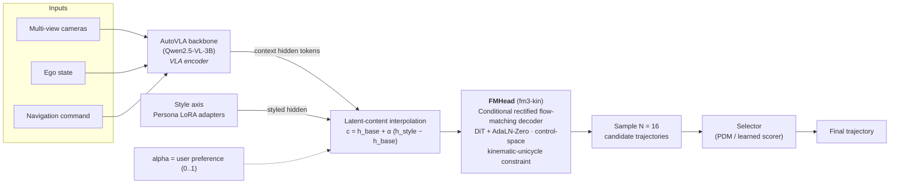

# fm3-aligned Persona Master Results Table (YouDrive fm3-kin)

navtest PDMS (v1) as the primary metric column, plus YouDrive style sub-metrics (DAI / PAI / SAI), kinematics, social gaps, and L2-to-teacher. Empty PDMS cells are configs not yet evaluated (no completed 8-shard navtest run).

| scope | teacher | alpha | PDMS | DAI | PAI | SAI | v_avg | peak_acc | peak_dec | long_jerk | lat_jerk | thw_min | ttc_min | lead_gap_min | dist_any_min | dist_vru_min | L2->teacher |
|---|---|---|---|---|---|---|---|---|---|---|---|---|---|---|---|---|---|
| anchor | human |  |  | 50.0000 | 50.0000 | 50.0000 | 4.6181 | 0.2446 | 0.3059 | 0.2898 | 0.1026 | 3.7850 | 4.3915 | 12.9060 | 4.5340 | 12.0630 | 50.6199 |
| anchor | base(AutoVLA) |  |  | 97.6043 | 48.2341 | 45.9373 | 4.6051 | 0.5282 | 0.6151 | 0.8865 | 0.4750 | 3.7640 | 4.3710 | 12.8275 | 4.5030 | 12.0780 | 97.5789 |
| sweep | gtrs | 0 | 0.9125 | 95.0358 | 56.7548 | 49.9877 | 4.8087 | 0.3810 | 0.4161 | 0.5134 | 0.5838 | 3.3120 | 3.6130 | 11.8250 | 4.4730 | 12.0490 | 95.6765 |
| sweep | gtrs | 0.25 | 0.9187 | 93.3070 | 59.0763 | 50.1111 | 4.8300 | 0.3713 | 0.3331 | 0.4590 | 0.5258 | 3.2140 | 3.5045 | 11.6580 | 4.4240 | 11.9630 | 94.2148 |
| sweep | gtrs | 0.5 | 0.9230 | 90.9113 | 60.3853 | 50.5310 | 4.9096 | 0.3741 | 0.2454 | 0.4101 | 0.4722 | 3.1210 | 3.3810 | 11.5660 | 4.3940 | 11.9520 | 92.0515 |
| sweep | gtrs | 0.75 | 0.9158 | 89.3554 | 63.0032 | 52.0622 | 4.9346 | 0.3753 | 0.1638 | 0.3818 | 0.4139 | 3.0620 | 3.2390 | 11.1695 | 4.3610 | 11.8570 | 91.0730 |
| sweep | gtrs | 1 | 0.9030 | 88.8614 | 64.9049 | 51.9141 | 4.9977 | 0.3849 | 0.1326 | 0.3728 | 0.3921 | 2.8625 | 3.0440 | 10.8545 | 4.2760 | 11.7870 | 90.9041 |
| sweep | gtrs | TEACHER |  | 0.1235 | 48.1106 | 41.5658 | 0.8871 | 0.0171 | 0.0177 | 0.0134 | 0.0039 | 4.0270 | 4.6615 | 14.1960 | 4.9570 | 12.7700 | 0.0000 |
| sweep | hydra_mdp | 0 | 0.9150 | 95.4063 | 56.6560 | 50.2099 | 4.8153 | 0.3743 | 0.4128 | 0.5238 | 0.5957 | 3.3200 | 3.6315 | 11.9905 | 4.4720 | 12.0320 | 95.9519 |
| sweep | hydra_mdp | 0.25 | 0.9191 | 93.4799 | 58.1378 | 51.2472 | 4.8250 | 0.3668 | 0.3568 | 0.4659 | 0.5304 | 3.2820 | 3.5350 | 11.7510 | 4.3980 | 11.9590 | 94.2722 |
| sweep | hydra_mdp | 0.5 | 0.9232 | 91.9733 | 58.9528 | 50.6792 | 4.8747 | 0.3631 | 0.2840 | 0.4316 | 0.5004 | 3.2250 | 3.4960 | 11.6775 | 4.4050 | 11.9580 | 92.8194 |
| sweep | hydra_mdp | 0.75 | 0.9198 | 90.9854 | 59.5703 | 51.8647 | 4.8833 | 0.3632 | 0.2337 | 0.4116 | 0.4722 | 3.1280 | 3.3625 | 11.3740 | 4.3740 | 11.9080 | 92.0275 |
| sweep | hydra_mdp | 1 | 0.9067 | 90.1951 | 60.8051 | 51.7165 | 4.9509 | 0.3856 | 0.2133 | 0.4010 | 0.4412 | 3.0530 | 3.2420 | 11.2290 | 4.3500 | 11.8650 | 91.3933 |
| sweep | hydra_mdp | TEACHER |  | 0.1235 | 48.2835 | 42.6031 | 0.9035 | 0.0170 | 0.0167 | 0.0135 | 0.0039 | 3.9170 | 4.6515 | 14.1240 | 4.9690 | 12.8480 | 0.0000 |
| sweep | wote | 0 | 0.9128 | 95.1346 | 56.8288 | 50.0864 | 4.7894 | 0.3865 | 0.4146 | 0.5159 | 0.5932 | 3.3670 | 3.6615 | 12.0690 | 4.4650 | 11.9930 | 13.2076 |
| sweep | wote | 0.25 | 0.9164 | 94.9617 | 57.0511 | 50.0370 | 4.8201 | 0.3828 | 0.3759 | 0.5068 | 0.5635 | 3.2790 | 3.5840 | 11.6820 | 4.4490 | 11.8890 | 13.1301 |
| sweep | wote | 0.5 | 0.9192 | 95.2334 | 57.0017 | 50.5310 | 4.8399 | 0.4052 | 0.3358 | 0.5185 | 0.5483 | 3.2160 | 3.4620 | 11.6325 | 4.4530 | 11.9950 | 13.6699 |
| sweep | wote | 0.75 | 0.9152 | 95.9249 | 56.5078 | 50.0370 | 4.8764 | 0.4007 | 0.3231 | 0.5490 | 0.5679 | 3.2080 | 3.4450 | 11.4520 | 4.3930 | 11.9430 | 13.5072 |
| sweep | wote | 1 | 0.9051 | 96.4189 | 57.6439 | 50.3334 | 4.8702 | 0.4223 | 0.2993 | 0.5654 | 0.6028 | 3.1610 | 3.3650 | 11.4460 | 4.3900 | 11.8680 | 14.2543 |
| sweep | wote | TEACHER |  | 88.7380 | 54.1368 | 38.8491 | 4.3269 | 0.2693 | 0.3496 | 0.4682 | 0.3516 | 4.1780 | 4.9650 | 14.3820 | 4.8985 | 12.8190 | 0.0000 |
| sweep | ddv2 | 0 | 0.9118 | 95.1099 | 56.5078 | 49.4196 | 4.7940 | 0.3794 | 0.4100 | 0.5236 | 0.5889 | 3.3130 | 3.6410 | 11.9560 | 4.4990 | 11.9990 | 17.9726 |
| sweep | ddv2 | 0.25 | 0.9262 | 98.3206 | 51.0002 | 50.5310 | 4.7682 | 0.5200 | 0.6112 | 0.8234 | 0.6351 | 3.2960 | 3.6320 | 11.8680 | 4.4540 | 11.9040 | 12.1611 |
| sweep | ddv2 | 0.5 | 0.9406 | 99.6789 | 42.7760 | 52.3092 | 4.8019 | 1.4282 | 1.3115 | 2.2109 | 1.0144 | 3.2270 | 3.6350 | 12.1850 | 4.4710 | 12.0180 | 5.6747 |
| sweep | ddv2 | 0.75 | 0.9467 | 99.8024 | 39.8617 | 57.0264 | 4.8995 | 2.5549 | 1.9862 | 3.7266 | 1.8909 | 3.0130 | 3.3460 | 11.8520 | 4.4440 | 11.7650 | 9.1606 |
| sweep | ddv2 | 1 | 0.9407 | 99.8024 | 38.9232 | 56.0632 | 4.8513 | 2.6606 | 2.1951 | 4.1235 | 2.5209 | 3.0275 | 3.2980 | 12.0275 | 4.4460 | 11.7610 | 8.1803 |
| sweep | ddv2 | TEACHER |  | 99.7777 | 39.2196 | 47.8884 | 4.8577 | 2.0381 | 1.9625 | 4.1628 | 1.9892 | 3.4170 | 3.9205 | 13.5680 | 4.9230 | 12.6070 | 0.0000 |
| sweep | goalflow | 0 | 0.9141 | 95.2334 | 56.7548 | 49.9877 | 4.7934 | 0.3773 | 0.4268 | 0.5184 | 0.6062 | 3.2760 | 3.6150 | 11.9410 | 4.5250 | 12.0600 | 18.4437 |
| sweep | goalflow | 0.25 | 0.9235 | 98.0242 | 50.8274 | 51.7165 | 4.7899 | 0.4476 | 0.6154 | 0.7507 | 0.6462 | 3.3200 | 3.6700 | 11.8880 | 4.4930 | 11.9030 | 13.5661 |
| sweep | goalflow | 0.5 | 0.9191 | 99.2344 | 47.0240 | 51.9634 | 4.7600 | 0.7489 | 0.8253 | 1.3588 | 0.8111 | 3.3030 | 3.6760 | 11.8095 | 4.4290 | 11.7950 | 10.8403 |
| sweep | goalflow | 0.75 | 0.9256 | 99.6542 | 42.9489 | 52.9020 | 4.8250 | 1.3531 | 1.2791 | 2.2369 | 1.0610 | 3.2000 | 3.5730 | 11.7940 | 4.4070 | 11.9710 | 9.6466 |
| sweep | goalflow | 1 | 0.9354 | 99.7530 | 42.1339 | 53.7170 | 4.8689 | 1.7530 | 1.5476 | 2.8498 | 1.2741 | 3.1210 | 3.4700 | 11.6940 | 4.4230 | 11.8470 | 10.2255 |
| sweep | goalflow | TEACHER |  | 99.7530 | 40.0099 | 43.7145 | 4.6061 | 1.6850 | 1.7739 | 3.7930 | 0.7634 | 3.7250 | 4.3440 | 13.8280 | 4.8980 | 12.7450 | 0.0000 |
| sweep | transfuser | 0 | 0.9125 | 95.0358 | 56.6066 | 50.1111 | 4.7557 | 0.3707 | 0.4147 | 0.5210 | 0.5929 | 3.3140 | 3.6410 | 12.0885 | 4.4800 | 12.0280 | 14.3974 |
| sweep | transfuser | 0.25 | 0.9153 | 93.9985 | 57.3969 | 49.9383 | 4.8027 | 0.3722 | 0.3703 | 0.4809 | 0.5427 | 3.3120 | 3.5900 | 11.8520 | 4.4420 | 11.9100 | 13.3855 |
| sweep | transfuser | 0.5 | 0.9158 | 93.0353 | 58.2613 | 49.9877 | 4.8546 | 0.3340 | 0.2893 | 0.4664 | 0.5207 | 3.2710 | 3.5230 | 11.7300 | 4.4420 | 11.9550 | 12.6295 |
| sweep | transfuser | 0.75 | 0.9112 | 92.8871 | 59.4468 | 49.4937 | 4.8675 | 0.3281 | 0.2427 | 0.4718 | 0.5205 | 3.2220 | 3.4175 | 11.6560 | 4.3890 | 11.8780 | 12.2369 |
| sweep | transfuser | 1 | 0.9004 | 93.1835 | 61.0521 | 48.5799 | 4.8629 | 0.3234 | 0.2142 | 0.4782 | 0.5148 | 3.1855 | 3.3540 | 11.3445 | 4.3690 | 11.8400 | 12.1605 |
| sweep | transfuser | TEACHER |  | 83.4527 | 58.4589 | 41.7634 | 4.5679 | 0.2320 | 0.2474 | 0.4006 | 0.2626 | 3.8750 | 4.5360 | 13.9250 | 4.8690 | 12.7710 | 0.0000 |
| combo | ddv2+goalflow 50/50 | 0 |  | 94.4431 | 57.7673 | 47.5673 | 4.6702 | 0.3693 | 0.4106 | 0.4911 | 0.5477 | 3.4320 | 3.8895 | 11.7170 | 4.2670 | 11.9975 | 19.3024 |
| combo | ddv2+goalflow 50/50 | 0.5 |  | 99.5307 | 44.8259 | 53.2477 | 4.8950 | 1.0565 | 0.9788 | 1.7424 | 0.7410 | 3.3390 | 3.7605 | 12.0920 | 4.4030 | 11.6645 | 7.7598 |
| combo | ddv2+goalflow 50/50 | 1 | 0.9500 | 99.8024 | 40.1581 | 55.5199 | 4.8309 | 2.4876 | 1.8331 | 3.6637 | 1.7195 | 3.0040 | 3.4865 | 12.5640 | 4.3570 | 11.6665 | 7.6890 |
| combo | ddv2+transfuser 70/30 | 0 |  | 95.3322 | 58.0637 | 50.2593 | 4.6855 | 0.3969 | 0.4244 | 0.5451 | 0.5824 | 3.4505 | 3.8525 | 12.0010 | 4.4610 | 11.9050 | 19.5061 |
| combo | ddv2+transfuser 70/30 | 0.5 |  | 99.4814 | 46.8017 | 53.1736 | 4.7260 | 1.0065 | 0.9937 | 1.6054 | 0.8264 | 3.3110 | 3.9040 | 12.8625 | 4.2290 | 11.8385 | 9.2472 |
| combo | ddv2+transfuser 70/30 | 1 | 0.9480 | 99.8024 | 39.8370 | 58.4095 | 4.8494 | 2.5248 | 2.0674 | 3.7133 | 2.1054 | 3.1130 | 3.3615 | 12.1140 | 4.1460 | 11.7070 | 10.5392 |
| combo | ddv2+transfuser 50/50 | 0 |  | 94.4431 | 56.5078 | 49.2467 | 4.6662 | 0.3770 | 0.4216 | 0.5056 | 0.5563 | 3.3440 | 3.8810 | 12.2510 | 4.3570 | 11.8960 | 18.1435 |
| combo | ddv2+transfuser 50/50 | 0.5 |  | 99.1850 | 49.6666 | 54.0133 | 4.8358 | 0.7557 | 0.6825 | 1.1434 | 0.6745 | 3.2300 | 3.8975 | 12.5060 | 4.4110 | 11.7720 | 12.1246 |
| combo | ddv2+transfuser 50/50 | 1 | 0.9475 | 99.7777 | 41.5658 | 55.0753 | 4.9691 | 2.0326 | 1.5691 | 2.8817 | 1.3920 | 3.0725 | 3.6615 | 11.9565 | 4.4330 | 11.8725 | 7.5602 |
| combo | ddv2+transfuser 30/70 | 0 |  | 94.7147 | 57.8908 | 49.6666 | 4.6315 | 0.3551 | 0.3993 | 0.4987 | 0.5591 | 3.4790 | 3.8380 | 11.6470 | 4.3180 | 11.8685 | 19.4271 |
| combo | ddv2+transfuser 30/70 | 0.5 |  | 97.7525 | 55.9644 | 54.6802 | 4.7204 | 0.5644 | 0.4788 | 0.7054 | 0.5833 | 3.1725 | 3.4600 | 11.2675 | 4.3330 | 11.9235 | 18.1830 |
| combo | ddv2+transfuser 30/70 | 1 | 0.9008 | 99.4073 | 51.2472 | 53.8898 | 4.9728 | 0.7749 | 0.5997 | 1.1111 | 0.7917 | 3.0730 | 3.4105 | 11.2915 | 4.2370 | 11.5775 | 13.4469 |
| combo | transfuser+goalflow 50/50 | 0 |  | 94.7394 | 58.8787 | 51.6424 | 4.6019 | 0.3802 | 0.4068 | 0.5020 | 0.6118 | 3.4090 | 3.8445 | 12.0840 | 4.2540 | 11.8660 | 20.6388 |
| combo | transfuser+goalflow 50/50 | 0.5 |  | 98.3206 | 50.4569 | 48.9998 | 4.6543 | 0.5435 | 0.6262 | 0.8534 | 0.6315 | 3.3145 | 3.8360 | 11.8075 | 4.2920 | 11.6380 | 11.3858 |
| combo | transfuser+goalflow 50/50 | 1 | 0.9206 | 99.5307 | 47.2709 | 50.5063 | 4.7809 | 1.0321 | 0.9105 | 1.5680 | 0.8838 | 3.2060 | 3.6705 | 11.0475 | 4.2370 | 11.5960 | 8.4699 |
| combo | ddv2+gtrs 60/40 | 0 |  | 95.0358 | 56.5078 | 49.6913 | 4.8211 | 0.3772 | 0.4230 | 0.5222 | 0.5745 | 3.3660 | 3.6365 | 12.0700 | 4.4430 | 11.9430 | 18.0172 |
| combo | ddv2+gtrs 60/40 | 0.5 |  | 99.4814 | 47.6908 | 52.7291 | 4.8853 | 0.8642 | 0.8730 | 1.4049 | 0.7874 | 3.1620 | 3.5695 | 11.8470 | 4.4390 | 11.9000 | 9.7612 |
| combo | ddv2+gtrs 60/40 | 1 | 0.9543 | 99.8024 | 40.6767 | 57.4710 | 5.0393 | 2.4151 | 1.9628 | 3.5283 | 1.8284 | 2.9325 | 3.2810 | 11.6675 | 4.3950 | 11.8510 | 9.6928 |
| combo | ddv2+hydra 60/40 | 0 |  | 95.0358 | 56.5819 | 49.2467 | 4.8050 | 0.3837 | 0.4156 | 0.5150 | 0.5817 | 3.3325 | 3.6315 | 11.9345 | 4.4730 | 12.0480 | 18.0494 |
| combo | ddv2+hydra 60/40 | 0.5 |  | 99.4814 | 47.8637 | 52.5068 | 4.8883 | 0.8822 | 0.8653 | 1.4252 | 0.7692 | 3.1735 | 3.5015 | 11.7565 | 4.4490 | 11.8000 | 9.8050 |
| combo | ddv2+hydra 60/40 | 1 | 0.9519 | 99.8024 | 40.9978 | 58.1131 | 5.0141 | 2.3923 | 1.9392 | 3.4845 | 1.8634 | 2.8890 | 3.2330 | 11.8015 | 4.3970 | 11.7950 | 10.3783 |
| combo | ddv2+goalflow 60/40 | 0 |  | 95.3322 | 56.5819 | 50.0370 | 4.7714 | 0.3876 | 0.4152 | 0.5209 | 0.5785 | 3.3210 | 3.6520 | 12.0120 | 4.4410 | 12.0400 | 18.0507 |
| combo | ddv2+goalflow 60/40 | 0.5 |  | 99.6295 | 44.4060 | 54.6061 | 4.8364 | 1.1836 | 1.1556 | 1.8826 | 0.8407 | 3.1810 | 3.5640 | 11.9270 | 4.4530 | 11.9990 | 8.4882 |
| combo | ddv2+goalflow 60/40 | 1 | 0.9494 | 99.8024 | 38.9232 | 56.3843 | 4.9343 | 2.6060 | 2.0955 | 3.9844 | 2.0162 | 3.0575 | 3.3890 | 11.8915 | 4.4170 | 11.7530 | 8.5011 |
| combo | ddv2+goalflow+hydra 40/40/20 | 0 |  | 95.1840 | 56.5078 | 50.1358 | 4.8012 | 0.3919 | 0.4078 | 0.5241 | 0.5892 | 3.3600 | 3.5970 | 12.1510 | 4.4510 | 11.9330 | 18.0288 |
| combo | ddv2+goalflow+hydra 40/40/20 | 0.5 |  | 99.4814 | 46.9252 | 53.5441 | 4.9062 | 0.8805 | 0.8821 | 1.4372 | 0.7460 | 3.1440 | 3.5290 | 11.6810 | 4.4320 | 11.7880 | 9.5630 |
| combo | ddv2+goalflow+hydra 40/40/20 | 1 | 0.9496 | 99.8024 | 40.7261 | 57.3969 | 5.0126 | 2.3134 | 1.7531 | 3.3477 | 1.5544 | 2.9870 | 3.3260 | 11.6890 | 4.4140 | 11.7960 | 9.6272 |
| combo | ddv2+goalflow+wote 45/45/10 | 0 |  | 95.1346 | 56.4584 | 50.1358 | 4.7759 | 0.3700 | 0.4090 | 0.5219 | 0.5820 | 3.3080 | 3.6165 | 11.8910 | 4.4810 | 11.9670 | 17.9941 |
| combo | ddv2+goalflow+wote 45/45/10 | 0.5 |  | 99.5801 | 45.8632 | 53.4947 | 4.8539 | 0.9849 | 0.9920 | 1.6205 | 0.7741 | 3.1700 | 3.5400 | 11.6570 | 4.4300 | 11.7750 | 8.6953 |
| combo | ddv2+goalflow+wote 45/45/10 | 1 | 0.9490 | 99.8024 | 39.8617 | 56.2608 | 4.9875 | 2.3998 | 1.8981 | 3.5852 | 1.6949 | 2.9790 | 3.2710 | 11.9215 | 4.4540 | 11.7420 | 8.3971 |
| combo | ddv2+goalflow+gtrs 40/40/20 | 0 |  | 95.4063 | 56.3349 | 50.0370 | 4.8166 | 0.3808 | 0.4260 | 0.5278 | 0.6010 | 3.3170 | 3.6605 | 11.9730 | 4.4720 | 12.0710 | 17.7950 |
| combo | ddv2+goalflow+gtrs 40/40/20 | 0.5 |  | 99.4814 | 47.1721 | 53.7170 | 4.9022 | 0.8959 | 0.8772 | 1.4354 | 0.7268 | 3.1600 | 3.5270 | 11.7180 | 4.4330 | 11.7760 | 9.8643 |
| combo | ddv2+goalflow+gtrs 40/40/20 | 1 | 0.9459 | 99.8024 | 39.9605 | 57.0758 | 5.0072 | 2.3323 | 1.7972 | 3.4049 | 1.5534 | 2.9580 | 3.2970 | 11.5530 | 4.4290 | 11.7800 | 9.2173 |
| combo | ddv2+goalflow+transfuser+gtrs 35/35/15/15 | 0 |  | 95.4063 | 55.9644 | 49.7407 | 4.7742 | 0.3777 | 0.4245 | 0.5315 | 0.6026 | 3.3510 | 3.6250 | 12.0720 | 4.4050 | 11.9640 | 17.4049 |
| combo | ddv2+goalflow+transfuser+gtrs 35/35/15/15 | 0.5 |  | 99.3579 | 47.6167 | 53.5194 | 4.8538 | 0.7870 | 0.8131 | 1.2800 | 0.7112 | 3.1810 | 3.4970 | 11.6360 | 4.4230 | 11.7960 | 10.1191 |
| combo | ddv2+goalflow+transfuser+gtrs 35/35/15/15 | 1 | 0.9402 | 99.8024 | 41.3188 | 57.0264 | 5.0196 | 2.0699 | 1.5952 | 3.0159 | 1.3398 | 3.0240 | 3.3060 | 11.4245 | 4.4000 | 11.7130 | 9.3761 |
| combo | goalflow+gtrs 50/50 | 0 |  | 95.2334 | 56.6066 | 50.0370 | 4.7870 | 0.3781 | 0.4171 | 0.5224 | 0.5869 | 3.3080 | 3.6370 | 11.9770 | 4.4350 | 12.0590 | 18.3263 |
| combo | goalflow+gtrs 50/50 | 0.5 |  | 98.4194 | 50.8768 | 51.7165 | 4.8540 | 0.5334 | 0.5611 | 0.8342 | 0.6375 | 3.2320 | 3.5480 | 11.5610 | 4.4120 | 11.7490 | 13.5610 |
| combo | goalflow+gtrs 50/50 | 1 | 0.9299 | 99.4814 | 47.2215 | 53.0995 | 4.9193 | 0.9743 | 0.9576 | 1.6231 | 0.8446 | 3.1040 | 3.4010 | 11.2400 | 4.3550 | 11.7250 | 11.8389 |

### Update 2026-07-29

Filled the master table with newly-completed **v1 (navtest PDMS)** experiments, aggregated as the
weighted average over 8 shards: PDMS = sum(S_i * N_i) / sum(N_i). All v1 tags below are complete
(8/8 shards, 12125 valid scenarios).

**New v1 single-teacher alpha sweeps filled (were empty / pending):**

| teacher | alpha | before | after |
|---|---|---|---|
| ddv2 | 0.25 | (empty) | 0.9262 |
| ddv2 | 0.75 | (empty) | 0.9467 |
| goalflow | 0.25 | (empty) | 0.9235 |
| goalflow | 0.75 | (empty) | 0.9256 |
| transfuser | 0.25 | (empty) | 0.9153 |
| transfuser | 0.75 | (empty) | 0.9112 |

**Single-teacher cells corrected to consistent v1 navtest PDMS** (gtrs / hydra / wote previously held
older non-v1 values in the PDMS column; ddv2 / goalflow / transfuser already matched v1 to full
precision and were left unchanged):

| teacher | alpha | before | after |
|---|---|---|---|
| gtrs | 0 | 0.9131 | 0.9125 |
| gtrs | 0.25 | 0.9137 | 0.9187 |
| gtrs | 0.5 | 0.9128 | 0.9230 |
| gtrs | 0.75 | 0.9135 | 0.9158 |
| gtrs | 1 | 0.9120 | 0.9030 |
| hydra_mdp | 0 | 0.9122 | 0.9150 |
| hydra_mdp | 0.25 | 0.9112 | 0.9191 |
| hydra_mdp | 0.5 | 0.9124 | 0.9232 |
| hydra_mdp | 0.75 | 0.9126 | 0.9198 |
| hydra_mdp | 1 | 0.9138 | 0.9067 |
| wote | 0 | 0.9127 | 0.9128 |
| wote | 0.25 | 0.9124 | 0.9164 |
| wote | 0.5 | 0.9129 | 0.9192 |
| wote | 0.75 | 0.9123 | 0.9152 |
| wote | 1 | 0.9120 | 0.9051 |

**New v1 combo rows added** (alpha=1 PDMS; alpha=0/0.5 rows carry style sub-metrics only, no
completed PDMS run):

| combo | alpha=1 PDMS |
|---|---|
| ddv2+gtrs 60/40 | **0.9543** |
| ddv2+hydra 60/40 | 0.9519 |
| ddv2+goalflow+hydra 40/40/20 | 0.9496 |
| ddv2+goalflow 60/40 | 0.9494 |
| ddv2+goalflow+wote 45/45/10 | 0.9490 |
| ddv2+goalflow+gtrs 40/40/20 | 0.9459 |
| ddv2+goalflow+transfuser+gtrs 35/35/15/15 | 0.9402 |
| goalflow+gtrs 50/50 | 0.9299 |

**Best PDMS now: 0.9543 — `ddv2+gtrs 60/40` @ alpha=1** (a new v1 combo). This improves on the previous
best of ~0.950 (`ddv2+goalflow 50/50` @ alpha=1 = 0.9500). Five of the new combos exceed 0.949.

**Tags found but NOT entered (out of v1 scope / incomplete — left as pending, not fabricated):**
several older non-interp/non-combo tags exist under `logs/` (e.g. `pdms_fm2_*`, `pdms_fm_oracle`,
`pdms_fmfull*`, `pdms_fmgate`, `pdms_*_pdmsel`) with <8 shards and/or 0 valid scenarios; these are
prior experiments unrelated to the v1 sweep and were not touched.

---

## Pipeline (VLA + Flow-Matching planner)

The configuration that produces the table above: the AutoVLA VLA backbone encodes the scene,
persona LoRAs define a style axis mixed by latent-content interpolation (`α`), the **fm3-kin
FMHead** samples N=16 dynamically-feasible candidate trajectories, and a selector returns one.

- **α axis:** `α = 0` reproduces the base AutoVLA behavior (PDMS ≈ 0.9125); increasing `α` applies
  the persona and moves the style sub-metrics (DAI/PAI/SAI, jerk, headway) — the trade-off swept in
  the table above.
- **Selector caveat:** the PDMS column uses the privileged `mode=pdm` selector and is a selection
  **upper bound**; a deployable selector (map-only / PDM-Closed forecasts / learned scorer) is the
  ongoing work.
